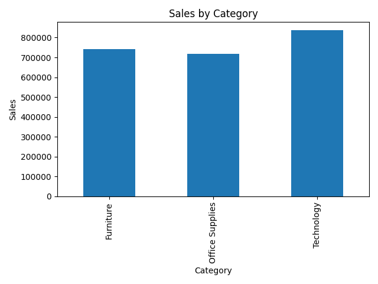
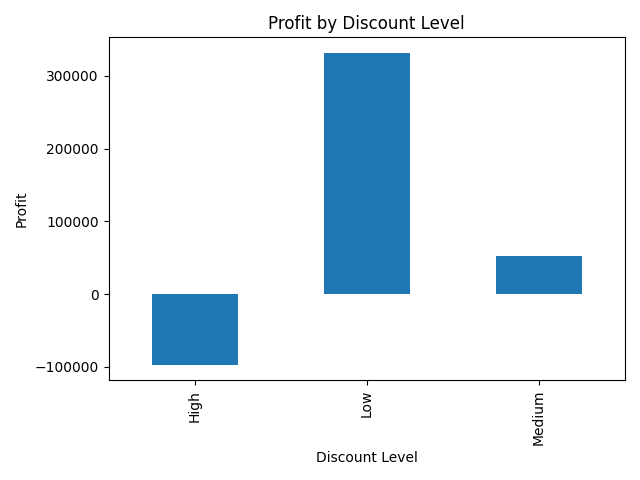

# 📊 Sales Performance Data Analysis

## 📌 Project Overview
This project analyzes sales data to identify trends, top-performing categories, and profitability patterns.

## 🛠 Tools Used
- Python
- Pandas
- Matplotlib

## 📂 Dataset
- Superstore Sales Dataset (CSV)

## 📊 Key Insights
- Technology category has highest sales
- Some products generate high revenue but low profit
- Discounts impact profit negatively

## 📈 Visualizations
### Sales by Category


### Profit vs Discount


## 🚀 How to Run
```bash
python modify_data.py